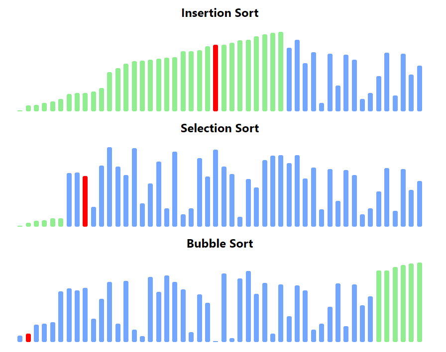

# Sorting algorithms visualization

Application shows in the neat way how the most popular sorting algorithms perform on the same randomly generated data.

The delay was added to illustrate specific time-complexity of each algorithm of the following algortihms:

* selection sort
* insertion sort
* bubble sort

Green bars indicate the sorted part of the data and the red bar points to the currently examinated bar.

## Live preview
soon
## Available Scripts

In the project directory, you can run:

### `npm start`

Runs the app in the development mode.\
Open [http://localhost:3000](http://localhost:3000) to view it in the browser.

### `npm test`

Launches the test runner in the interactive watch mode.\
See the section about [running tests](https://facebook.github.io/create-react-app/docs/running-tests) for more information.

### `npm run build`

Builds the app for production to the `build` folder.\
It correctly bundles React in production mode and optimizes the build for the best performance.

